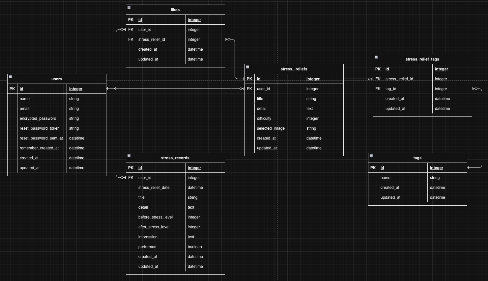

# RecordSRM

## サービス概要
* オススメのストレス解消法（Stress Relief Method：SRM）を共有でき、共有されている方法や自分で見つけた方法を実際に試して、その結果を記録できるサービスです。

## サービスURL
* https://www.recordsrm.com

## 想定されるユーザー層
* 効果的なストレス解消法を探している人
* 他の人がどのようにストレスを解消しているのかを知りたいと思っている人
* 自身のストレス解消法を共有したいと思っている人
* 既に何らかの方法を試しているが、その効果を定量的に知りたいと思っている人

## サービスコンセプト
* 現代社会では多くの人がストレスを抱え、その解消法は人によって異なります。自分に適したストレス解消法を見つけること、そしてその効果を数値で確認するのは容易ではありません。RecordSRMでは、ユーザー間でオススメのストレス解消法を共有することで、新たな解消法を見つけるきっかけを提供します。さらに、試したストレス解消法の結果を記録し、その効果を数値化・視覚化することで、より効果的なストレス対策の発見と実行をサポートします。

## 機能一覧
* ユーザー登録機能
* ログイン機能
* オススメのストレス解消法の一覧/投稿/詳細/更新/削除機能
* Xシェア機能
* いいね機能
* ストレス解消法を実施した結果を記録一覧/投稿/詳細/更新/削除機能
* ストレスレベルの変動を表示するグラフ機能(週単位/月単位)
* ユーザーに合ったストレス解消法をお勧めしてくれる機能
* オススメのストレス解消法を検索/オートコンプリート機能
* ページネーション機能

## 使用技術
### バックエンド
* Ruby 3.2.2
* Ruby on Rails 7.0.7

### フロントエンド
* Hotwire
* JavaScript
* Tailwind CSS
* daisyUI

### インフラ
* Heroku

## 画面遷移図
https://www.figma.com/file/DB6esyvYiVov5G5o497PtD/%E7%94%BB%E9%9D%A2%E9%81%B7%E7%A7%BB%E5%9B%B3?type=design&node-id=0%3A1&mode=design&t=n5Y5LdFE9Mygvyzm-1

## ER図

